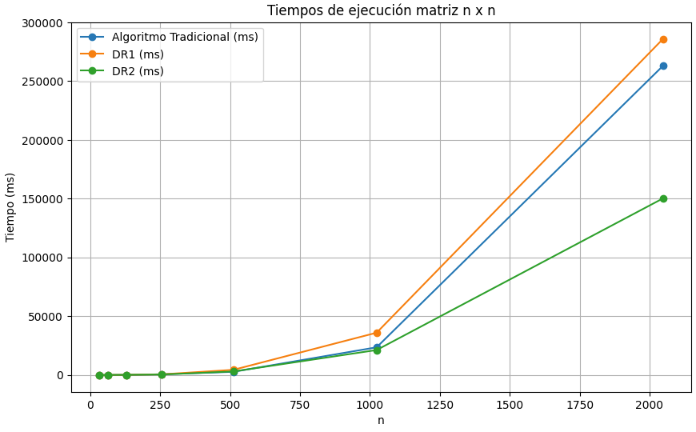

> [!NOTE]
> Tarea desarrollada para la asignatura de **Algoritmos y Estructuras de Datos Avanzados** de la carrera de Magíster en Ciencias de la Computación.

## 📘 Tarea: Multiplicación de Matrices

Este código implementa y analiza la **multiplicación de matrices** con algoritmo tradicional, divide y conquista y strassens's.

El enunciado completo del segundo problema está disponible en el siguiente [archivo](./docs/enunciado.pdf).

Las respuestas correspondientes se encuentran en el siguiente [archivo](./docs/respuestas.pdf).

## 📈 Resultados

A continuación se presenta el análisis comparativo de los tres algoritmos implementados para la multiplicación de matrices: el algoritmo tradicional, el método divide y vencerás, y el algoritmo de Strassen.



La gráfica muestra los tiempos de ejecución de cada algoritmo según el tamaño de las matrices, permitiendo observar las ventajas y desventajas de cada enfoque.

## ⚙️ Instrucciones de Compilación y Ejecución

Asegúrate de tener `g++` instalado en tu sistema. Luego, sigue los siguientes pasos para compilar y ejecutar el código:

1. Compilación:

```bash
make
```

2. Limpieza de Compilación:

En caso de querer eliminar los archivos compilados:

```bash
make clean
```

3. Ejecución:

```bash
./main
```

## 📁 Estructura del Código

- `main.cpp`: Función principal que ejecuta las funciones para comparar algoritmos.
- `matrix_algorithms/`: Contiene las implementaciones del algoritmo tradicional, divide y vencerás (DR1) y Strassen (DR2).
- `utils/`: Funciones auxiliares para la generación de matrices, operaciones básicas (suma, resta, división, combinación) y utilidades adicionales.
- `docs/`: Enunciado original de la tarea con sus respectivas respuestas.

## 👥 Autores

⌨️ with ❤️ by [@Didudocl](https://github.com/Didudocl) y [@bamm99](https://github.com/bamm99)